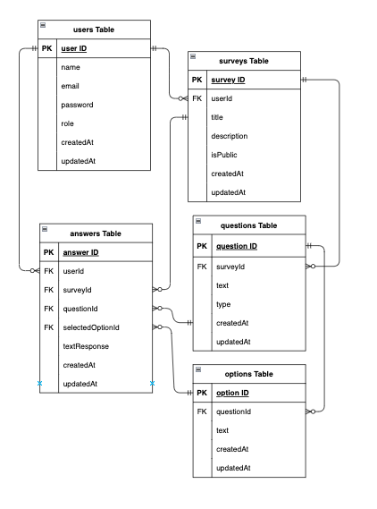

# Survey

【概要】選択式アンケートを作成し、URLを配布し回答させることができるシステム

## 機能一覧

| 項目 | 項目 (管理者) |
| ---- | ---- |
| 会員登録 | ログイン |
| ログイン | ログアウト |
| ログアウト | 回答可能アンケート一覧取得 |
| 回答可能アンケート一覧取得 | アンケートの公開・非公開の変更機能 |
| アンケート回答機能 | アンケート回答機能 |
| アンケート集計結果表示 | アンケート集計結果表示 |
|  | アンケート作成機能 |

## 使用技術

* Nest.js v10.4.4
* Next.js v14.2.12
* Typeorm v0.3.20
* GraphQL v16.9.0
* Docker Desktop v4.37.0
* docker-compose v3.8
* mySQL 8.0.26

## ER図

# 環境構築

## git clone

先にコピーを保存したいディレクトリに移動してから以下のコマンドを実行します。

`$ git clone git@github.com:sasaiatocos/survey.git`

これでプロジェクトがローカル環境にクローンされます。

## 開発環境の構築(バックエンド)

以下のコマンドで開発環境を構築します。

`$ docker-compose up -d --build`

実行終了後、Docker Desktopを確認し、`survey`コンテナが作成されているかを確認してください。

## .envファイルを作る
git cloneしてきたプロジェクトに入っている`.env.example`ファイルを基に以下のコマンド実行で`.env`ファイルを作成します。

`$ cd backend`
`$ cp .env.example .env`
`$ exit`

作成後、`.env`ファイルの内容を以下のように修正します。

// 前略

DB_CONNECTION=mysql  
DB_HOST=mysql  
DB_PORT=3306  
DB_DATABASE=nest_db  
DB_USERNAME=nest_user  
DB_PASSWORD=nest_pass  

JWT_SECRET='`openssl rand -base64 32`の実行結果'

// 後略

## 動作確認（バックエンド）
以下のコマンド実行で、動作確認を行ってください。

`$ cd backend`
`$ npm run start:dev`

## 動作確認（フロントエンド）
以下のコマンド実行で、動作確認を行ってください。
http://localhost:3001 で画面が表示されれば成功です。

`$ cd frontend`
`$ npm run dev`

